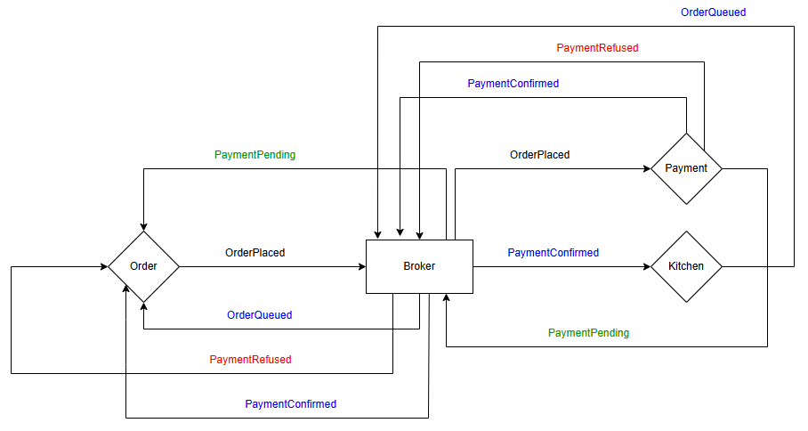
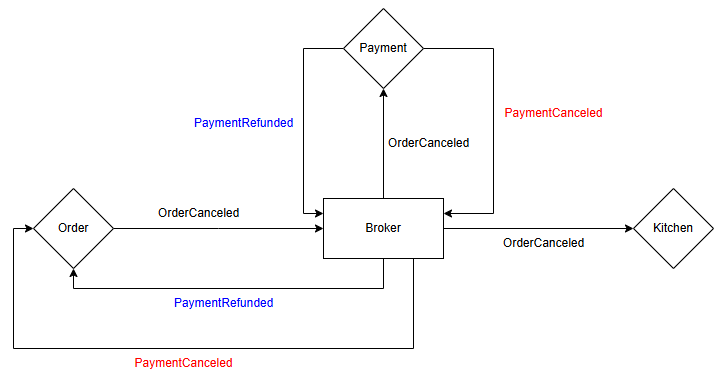

# Objetivo e Descrição do Trabalho

Esse trabalho tem como objetivo ser um guia prático para a implementação de projetos baseados nas arquiteturas de microsserviços e orientada a eventos. O tema da aplicação desenvolvida é um Sistema de Gerenciamento de Delivery de Supermercados. Ademais, vale ressaltar que esse trabalho não tem como intuito implementar todos os aspectos do tema base base da aplicação em termos de funcionalidades, mas apenas o suficiente para mostrar as tomadas de decisão em relação aos problemas que surgem e as respectivas soluções nos contextos de cada arquitetura, já mencionadas acima.

## Aspectos fundamentais das arquiteturas

Caracterítiscas fundamentais e essenciais de cada arquitetura

### Microsserviços

### Arquitetura Orientada a Eventos

## Delimitação

Nesse tópico será delimitado a resolução para alguns problemas que serão enfrentados em projetos como esses. O atual trabalho visa abordar apenas os aspectos fundamentais anteriormente definidos que na visão desse trabalho são bases fundamentais e mínimas para projetos que utilizam esses tipos de arquiteturas, são eles:

- Decomposição dos Microsserviços
- Comunicação Assíncrona vs Síncrona
- Padrão de comunicação das API's
- Organização quanto a emissão e reação aos eventos
- Broker para o armazenamento dos eventos

## Descrições Técnicas do Projeto

### Microsserviços

#### Visão Macro da Arquitetura

#### Definição dos Microsserviços

- Pedidos
- Notificação
- Pagamento
- Entrega
- Estoque
- Usuário
- Supermercados
### Arquitetura Orientada a Eventos

#### Eventos

Relação dos eventos gerados e escutados por cada um dos microsserviços, além da orquestração destes mesmos em relação a aqueles. Vale ressaltar que só está sendo mostrado os microsserviços que utilizam eventos para se comunicarem, sendo excluídos dessa lista os de Usuários e de Supermercados.

##### Order

- Gerados:
  - OrderPlaced
  - OrderCanceled
  - OrderUpdated
  - OrderConfirmed

##### Delivery

- Gerados:
  - OrderBeingPrepared
  - OrderReadyForDelivery
  - OrderOutForDelivery
  - DeliveryFailed
  - DeliveryConfirmed
- Escutados:
  - PaymentConfirmed
  - PaymentRefused
  - PaymentRefunded
  - OrderInPreparation
  - OrderQueued
  - OrderOutForDelivery
  - OrderDeliveryFailed
  - OrderDelivered

##### Stock

- Gerados:
  - StockReserved
  - StockReleased
  - StockPrepared
  - StockNotFounded
- Escutados:
  - OrderPlaced
  - OrderUpdated
  - OrderCanceled

##### Payment

- Gerados:
  - PaymentConfirmed
  - PaymentRefunded
  - PaymentFailed
- Escutados:
  - OrderCanceled
  - OrderUpdated *Nesse caso aqui tem que ver como vai ser do pagamento para a cozinha*

#### Cozinha

- Gerados:
  - OrderQueued
  - OrderInPreparation
  - OrderCompleted
- Escutados:
  - PaymentConfirmed
  - OrderCanceled

### Orquestração dos Eventos

#### OrderPlaced

#### OrderCanceled

#### OrderUpdated

### Tecnologias Utilizadas

- Docker
- PostgreSQL
- RabbitMQ
- Typescript
- NestJS
- TypeORM
