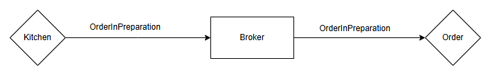
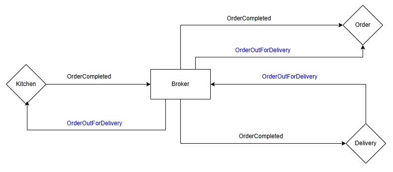

# Objetivo do Trabalho

Esse trabalho tem como objetivo ser um guia prático para a implementação de microsserviços orientado a eventos. O mesmo tem como público desenvolvedores que estão iniciando em projetos desse escopo. Além disso o projeto desenvolvido ao longo desse trabalho bem como a tomada de decisão é baseada no desenvolvimento de uma aplicação com o seguinte tema: *Sistema de um Restaurante de Delivery*.

## Características Básicas

Características básicas e essenciais que um projeto implementado utilizando microsserviços e arquitetura orientada a eventos deve apresentar

### Microsserviços

- Autonomia: Cada microserviço é independente e deve ser capaz de operar sem depender diretamente de outros microserviços. Isso facilita a escalabilidade e o falhas.
- Especialização: Cada microserviço é responsável por uma funcionalidade específica, como pedidos, controle de estoque ou processamento de pagamentos. Essa especialização promove coesão e simplifica a manutenção.
- Comunicação por APIs: Os microserviços se comunicam entre si por meio de APIs (normalmente REST ou gRPC), garantindo que as interfaces sejam bem definidas e os serviços sejam desacoplados.
- Descentralização de Dados: Cada microserviço deve possuir seu próprio banco de dados para garantir independência total, evitando o compartilhamento direto de dados entre eles.
- Escalabilidade Independente: Cada serviço pode ser escalado de acordo com a demanda específica de sua função, otimizando o uso de recursos e permitindo uma resposta mais eficiente ao aumento de usuários.

### Arquitetura Orientada a Eventos

- Eventos: São mensagens que representam uma mudança de estado, como a criação de um pedido ou a confirmação de um pagamento. Estes eventos desencadeiam ações em outros componentes ou serviços interessados.
- Produtores de Eventos: São os serviços que geram e publicam eventos para notificar outras partes do sistema sobre mudanças. Por exemplo, um serviço de pedidos que gera um evento quando um novo pedido é criado.
- Consumidores de Eventos: São serviços que escutam e reagem aos eventos, executando ações em resposta a mudanças, como um serviço de inventário que atualiza o estoque quando um pedido é feito.
- Mediadores de Mensagens (Message Brokers): Ferramentas como Apache Kafka ou RabbitMQ, que facilitam o roteamento e a entrega de eventos entre produtores e consumidores, garantindo que os eventos sejam entregues corretamente e em ordem.
- Tópicos ou Filas: Estruturas onde os eventos são armazenados temporariamente até que os consumidores os processem, facilitando a distribuição e o controle de fluxo dos eventos.

## Delimitação do Guia

Esse guia tem como foco mostrar a tomada de decisão bem como o embasamento quanto aos seguintes aspectos de um projeto que envolva tais arquiteturas:

- Aspecto 1
- Aspecto 2
- Aspecto 3
- Aspecto 4

## Decomposição dos Microsserviços

Aqui estão todos os microsserviços que irão compor o escopo do problema escolhida como tema do projeto. A decomposição dos serviços foi feita com base *Aqui cita o nome do padrão utilizado para a decomposição, além de toda a referência e o racional*

- Pedidos
- Entregas
- Clientes
- Cozinha
- Pagamento
## Eventos

### Eventos Gerados e Produzidos por cada Serviço

#### Pedidos

- Gerados:
  - OrderPlaced
  - OrderCanceled
  - OrderUpdated
- Escutados:
  - PaymentConfirmed
  - PaymentRefused
  - PaymentRefunded
  - OrderInPreparation
  - OrderQueued
  - OrderOutForDelivery
  - OrderDeliveryFailed
  - OrderDelivered

#### Entregas

- Gerados:
  - OrderOutForDelivery
  - OrderDelivered
  - OrderDeliveryFailed
- Escutados:
  - OrderCompleted

#### Pagamentos

- Gerados:
  - PaymentConfirmed
  - PaymentRefused
  - PaymentPending
  - PaymentRefunded
- Escutados:
  - OrderCanceled
  - OrderUpdated *Nesse caso aqui tem que ver como vai ser do pagamento para a cozinha*

#### Cozinha

- Gerados:
  - OrderQueued
  - OrderInPreparation
  - OrderCompleted
- Escutados:
  - PaymentConfirmed
  - OrderCanceled

### Orquestração dos Eventos

#### OrderPlaced

#### OrderCanceled

#### OrderUpdated

#### OrderInPreparation

#### OrderCompleted

## Tecnologias Utilizadas no Projeto

- Docker
- PostgreSQL
- Typescript
- Nest JS
- RabbitMQ
- Prisma
